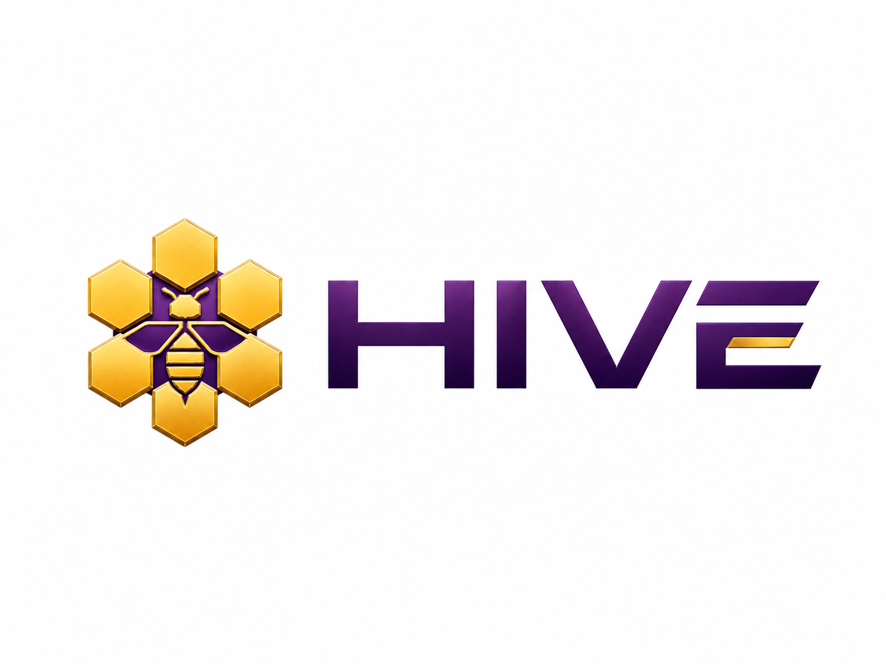

<p align="center">
  
</p>

[](https://github.com/scottdev1986/hive/actions/workflows/release.yml)
[](https://github.com/scottdev1986/hive/releases/latest)
[](LICENSE)

Hive coordinates Claude Code, Codex, and Grok agents in a native macOS Workspace. A read-only orchestrator named queen delegates work; each worker gets an isolated git worktree, branch, capability, and daemon-owned `sessiond` session. Talk to queen for decomposition and routing; workers report back to queen. The architectural role remains orchestrator, and addressing the root as `orchestrator` is still understood. The daemon owns process lifecycle and merges completed branches into `main` through a serialized fast-forward gate.

Hive combines Graphify's local code graph with local semantic embeddings to give agents useful context before they act. Graphify maps repository structure, symbols, and relationships; embeddings retrieve relevant project memory by meaning. Hive builds and maintains both as part of repository setup, and both operate locally.

Hive is currently a 0.0.x project. Its command and storage contracts may change between releases.

## Workspace

Run `hive` in an initialized repository to create a fresh Hive instance and open its Workspace window. Running it again creates another isolated instance and another window, even from the same repository. queen is the master pane — the orchestrator that coordinates the team — and worker agents use the same HiveTerminalKit panes attached to daemon-owned `sessiond` sessions. The vendor TUI remains interactive: clicking a pane focuses it, and typing goes directly to that Claude Code, Codex, or Grok session.

Agent state comes from structured daemon events, not terminal scraping. Unknown or disconnected state is displayed as unknown rather than inferred from pane contents.

Closing an agent pane detaches that view without killing the agent. Explicit Hive lifecycle commands preserve unlanded work and verify that the daemon-owned `sessiond` process tree is gone. Closing the Workspace normally runs `hive stop`, which stops the instance's agents and daemon. An unexpected UI crash does not own the agent processes, so their sessions remain recoverable.

## Requirements

- macOS on Apple Silicon or Intel
- git, installed through its supported distribution for your system
- At least one signed-in agent CLI: [Claude Code](https://code.claude.com/docs), [Codex](https://developers.openai.com/codex), or [Grok](https://docs.x.ai/build/overview)

The release includes the CLI and Workspace app. Bun, Swift, Python, and `uv` are not required to use an installed release.

## Installation

```sh
curl -fsSL https://raw.githubusercontent.com/scottdev1986/hive/main/install.sh | sh
```

The installer supports macOS only. It requires non-empty Hive manifest signature material, downloads the CLI and Workspace app, checks both SHA-256 digests against the release manifest, runs the candidate CLI and verifies its reported version, then atomically updates `~/.local/bin/hive`. If `~/.local/bin` is not on `PATH`, it prints the required change.

Portable shell does not verify the manifest's Ed25519 signature; presence is required, but first-install authenticity still rests on TLS and GitHub Release hosting. The installer stores the exact manifest bytes and normalized signature so Hive can verify them before a future rollback. Native `hive update` is stricter: it requires a valid signature from an embedded release key, checks artifact hashes, and probes the candidate before activation. See [distribution](docs/release/distribution.md) for the complete trust boundary.

Development-build acceptance never runs this installer over an existing Hive. It uses a marked temporary install while the installed app and daemon remain continuously live; see the [acceptance runbook](docs/release/acceptance-testing.md).

## Quick start

From a git repository:

```sh
cd /path/to/repository
hive init
hive
```

`hive init` prepares the repository for Hive: it installs agent skills, builds the local Graphify code graph, seeds supplied narrative memory, and installs the local embedding runtime. It does not start a daemon or open a Workspace, and it is safe to run again. If Graphify setup is interrupted or offline, init reports the degraded state and `hive graphify enable` completes it.

Bare `hive` opens the Workspace with Claude as queen's default vendor. To choose another installed vendor for the orchestrator explicitly, run `hive codex` or `hive grok`; `hive claude` is the explicit Claude spelling.

Codex receives Hive's role and protocol bootstrap as developer instructions, so
a fresh root opens at an empty composer instead of showing the setup wall. A
worker's assignment remains its visible initial user message.

## Commands

| Command | Purpose |
| --- | --- |
| `hive` | Create a fresh isolated instance and open its Workspace |
| `hive init` | Prepare agent skills, Graphify, memory, and embeddings without starting a daemon |
| `hive claude`, `hive codex`, `hive grok` | Open the Workspace with queen on that read-only orchestrator vendor |
| `hive status` | Show agent name, tool, model, state, context use, task, and failure |
| `hive kill <agent>` | Stop one agent and preserve any unlanded work |
| `hive recover [name]` | Resume one or all recoverable crashed sessions |
| `hive stop` | Stop the instance's live agents and daemon |
| `hive autonomy [sandboxed\|dangerous]` | Read or change writer-agent autonomy |
| `hive routing ...` | Read and edit provider, model, effort, selection, and fallback-chain policy |
| `hive quota` | Show provider capacity, reservations, provenance, and reset times |
| `hive memory ...` | Search, read, write, delete, reindex, self-test, or consolidate durable memory |
| `hive embeddings install` | Install the local semantic-memory embedding runtime |
| `hive graphify enable\|status` | Build, refresh, or inspect Hive's local code graph |
| `hive update [version]` | Install the latest or an exact release |
| `hive update check\|status\|rollback\|skip` | Check, inspect, roll back, or skip an offered release |
| `hive uninstall [--repo]` | Remove the machine installation, or only this repository's Hive state |
| `hive instances` | List the default and named Hive instances |

Run `hive <command> --help` for the complete options. Hook, local capability-helper, daemon, and statusline commands also appear in `hive --help`; they are process-integration surfaces rather than normal interactive workflow commands.

## Isolation and multiple instances

The default home at `~/.hive` stores setup and preference state. Every ordinary Workspace launch selects a fresh runtime home under `~/.hive/instances/run-<uuid>` before starting its daemon. An explicit named instance uses `~/.hive/instances/<name>` when stable naming is needed:

```sh
hive --instance client-a init
hive --instance client-a
hive instances
```

Instances have separate identity, daemon lock, ephemeral port, handshake, database, local control-plane capabilities, `sessiond` runtime, worktrees, and owned branches. Repository landing is serialized across instances. Provider quota is deliberately machine-wide because it belongs to the signed-in vendor account, not to one Hive instance. Hive never reads, stores, or manages provider passwords, API keys, session secrets, or keychain entries; provider sign-in remains entirely owned by each vendor CLI.

Machine-wide update, rollback, and uninstall operations refuse while any instance has a live or unobservable team. Repository uninstall removes only the current repository's Hive footprint. It stops the selected daemon only after its handshake proves it serves that repository; a daemon serving another repository is never signaled.

For acceptance isolation outside `~/.hive`, set a test-owned `HIVE_HOME` directly and do not combine it with `--instance`, which selects a home below `~/.hive/instances`. Bind every later CLI operation to that recorded home and verify its port/handshake identity before lifecycle or UI actions. Shell environment does not automatically cross LaunchServices, Workspace, root, or UI boundaries; verify the absolute Hive executable and complete instance tuple at each boundary. See [Pre-release acceptance testing](docs/release/acceptance-testing.md).

## Autonomy and routing

Writer agents default to `sandboxed`: vendor permission controls remain active and risky operations enter Hive's approval path. `hive autonomy dangerous` removes those prompts for future spawns and resumes; it is equivalent to granting the underlying agent CLI broad access, so use it deliberately. queen (the orchestrator) remains read-only in either mode.

Routing is explicit policy, not a compiled model ranking. The Model Control Center and `hive routing` keep provider consent, model consent, effort, automatic selection, exact selection, and ordered fallback chains as separate values. Hive uses provider quota readings when available and prints `unknown` when a meter cannot be read; it does not turn missing telemetry into zero.

## Memory

Hive remembers. Agents do not start blank: project knowledge, session history, and hard-won lessons persist across sessions and are shared by every agent on the project — Claude Code, Codex, and Grok today, with Kimi Code and opencode joining when their adapters land.

Memory has three layers. The curated wiki holds verified project knowledge as Markdown under `.hive/memory` (gitignored automatically by `hive init`). The episodic store keeps a per-project typed history with time-travel semantics — a contradiction stamps a fact invalid rather than deleting it — under `~/.hive/projects/`. Pitfalls are mistakes harvested from failed sessions, verified, and then warned to every future agent.

Recall is summoned, never left to agent goodwill. Every agent is briefed with a ranked memory index at spawn — pitfalls matching the assignment first — and receives a bounded delta of what changed when it wakes. queen or the operator can summon memory explicitly with message triggers the daemon executes: `recall: <question>` searches and injects the results, `note this: <fact>` records an observation, and `document this: <topic>` scaffolds a curated article.

Semantic (meaning-based) recall runs locally on Hive's bundled bge-small model (~360 MB RSS warm). `hive init` installs the embedding runtime and Hive updates it with the product. If the machine is offline during setup, recall uses keyword search until `hive embeddings install` completes the local runtime.

```sh
hive memory search "quota"                 # full-text search compiled articles
hive memory read repo <id>                 # print one article
hive memory write "Title" --scope repo …   # record an observation (--help lists the required fields)
hive memory delete repo <id>               # reference-checked delete
hive memory reindex                        # rebuild the search index after manual edits
hive memory self-test [--live] [--strict]  # golden-canary health proof
hive memory consolidate [--apply]          # report, then merge, duplicate memories
hive embeddings install                    # provision the embedding runtime
```

Memory behavior is tuned under `[memory]` and `[memory.retention]` in `~/.hive/config.toml`: the wake-delta budget defaults to 300 tokens, episodic events stay hot for 30 days, and verified articles demote to stale after 90 days.

Isolation is structural: each project's memory is scoped by the daemon's own identity, and no agent reads a sibling project. Promotion to global memory is explicit, human-approved, and redaction-checked.

## Optional configuration

No configuration file is required.

- `~/.hive/config.toml` controls writer autonomy, the Codex driver, resource limits, and idle-agent reaping. The Workspace Agents menu and `hive autonomy` persist the autonomy value here.
- Routing policy is stored in Hive's SQLite control store and edited through the Model Control Center or `hive routing`.
- `~/.hive/quota.toml` can overlay planning estimates, reserves, warning thresholds, refresh cadence, and account/model-specific limits on provider discovery.

Hive rejects unknown configuration keys instead of silently ignoring misspellings.

## Updates and rollback

`hive update` downloads and verifies the safe half before it tries to activate anything. Activation then holds the machine mutation lease and repeats an all-instance liveness check. If any team is live or cannot be observed, the release stays staged and the command explains what must stop.

`hive update rollback` works offline but is not an unsigned shortcut: it re-verifies the retained version's signed manifest and CLI hash before changing `current`. A legacy release without rollback verification material must be reinstalled first.

Set `HIVE_NO_UPDATE_CHECK=1` to disable passive update checks, or `HIVE_DISABLE_UPDATES=1` to disable both checks and manual self-update.

During development-build acceptance, bind both variables on each shell invocation and allow only the read-only `hive update status`; update, rollback, uninstall, activation, and installed-daemon restart are outside the acceptance contract. These variables are defense in depth only when the process actually receives them; the acceptance runner must enforce ownership separately. Hive does not yet ship that complete runner, so manual or prompt-only evidence cannot make the strict “never targeted” attestation.

## Development

The CLI and daemon are TypeScript on Bun; the Workspace is Swift/AppKit. From a checkout:

```sh
bun install
bun test
bun run typecheck
```

To build and run the development program itself. These four commands are the
whole make surface — there is nothing else to run by hand, and every heal or
remediation step runs automatically inside them:

```sh
make clean   # stop the dev instance, then delete every dev artifact
make build   # pinned Zig, GhosttyKit, sessiond, the CLI and the Workspace app
make run     # launch the staged dev Workspace against this hive checkout
make test    # bun suites + sessiond (Zig) + Workspace (Swift)
```

`make build` does a complete build every time: correctness outranks
incrementality. A bare `make` is `make build`.

The native build uses the system `zig` on PATH, **pinned to Zig 0.15.2** by
`native/toolchain-lock.json` — a declared constraint, not a preference: the
vendored Ghostty tree does not build on Zig 0.16, and
`native/sessiond/build.zig` enforces the 0.15.x requirement at build time
with an explanatory error. Install it with:

```sh
brew install zig@0.15 && brew link --force zig@0.15
```

Zig caches and lock-keyed GhosttyKit artifacts live in a per-user cache
(`~/.cache/hive/native`, override with `HIVE_NATIVE_CACHE`), so every
worktree — including fresh agent worktrees — shares compiled native
dependencies instead of cold-building them.

`make build` stages a consumer-shaped, unsigned release under `.dev/`, and
`make run` launches it fully isolated from any installed hive — every
rendezvous name derives from a short per-checkout `HIVE_HOME` under
`/tmp/hv-<digest>` (sessiond canonicalizes the home to `/private/tmp/...`
before binding per-session sockets, and a longer home overflows macOS
`sun_path`). With no argument it opens the checkout you run it from —
inside an agent worktree, that worktree. Pass `PROJECT=/path/to/repo` to open a
different git repo instead.

`make clean` stops the dev instance and then deletes `.dev/` — in that order,
and never the second without the first. It signals the dev Workspace app,
`sessiond`, and the provider CLIs started under it, re-reads the process table
to confirm they are gone, and only then removes the directory. If anything is
still running it refuses to delete `.dev/` and exits non-zero rather than
stranding a live process against a directory that no longer exists.

Dev processes are selected by executable path and arguments — never by process
name — so a running installed hive, which has its own Workspace, `sessiond`,
and provider CLIs, is never a candidate.

`make run` is the product entrypoint: the daemon owns the sessiond broker and
agent panes with a sessiond locator render through HiveTerminalView. B2.5
records the production vendor matrix (row K) under the make-run stack. It needs
an unlocked Aqua GUI session.

The M1 attach/smoke harness (login shell / B2.2 proof) is no longer a make
target. Run its script directly after `make build`; it builds the debug app it
launches on its own:

```sh
make build
HIVE_B22_REAL_SHELL=1 HIVE_B22_NO_APP=0 HIVE_B22_PORT=43117 \
  bun scripts/b22-live-attach-proof.ts
```

Drop `HIVE_B22_REAL_SHELL=1` for the watched B2.2 ticker instead of a login
shell. The harness needs an unlocked Aqua GUI session and a free port 43117.

Issues and focused pull requests are welcome.

## License

[MIT](LICENSE)
