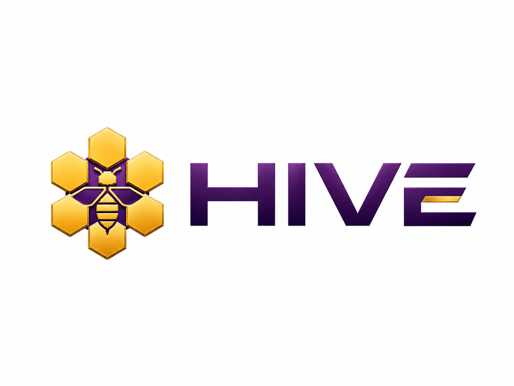

<p align="center">
  
</p>

[](https://github.com/scottdev1986/hive/actions/workflows/release.yml)
[](https://github.com/scottdev1986/hive/releases/latest)
[](LICENSE)

Hive is a native macOS workspace for a team of coding agents. You talk to **queen**, who plans the work and delegates it. Workers run as [Claude Code](https://code.claude.com/docs), [Codex](https://developers.openai.com/codex), [Grok](https://docs.x.ai/build/overview), [Kimi Code](https://moonshotai.github.io/kimi-code/en/guides/getting-started.html), or [OpenCode](https://opencode.ai/docs/). Each worker gets its own git worktree and branch. Finished work lands back onto the branch you have checked out.

Hive is currently 0.0.x. Commands and on-disk layout may change between releases.

## Requirements

- macOS, Apple Silicon or Intel
- [git](https://git-scm.com)
- At least one signed-in agent CLI from the list above

The release includes the `hive` command and the Workspace app. You do not need Bun, Swift, Python, or extra toolchains to use an installed release.

Hive never reads or stores provider passwords, API keys, or keychain entries. Sign in with each vendor's own CLI.

## Installation

```sh
curl -fsSL https://raw.githubusercontent.com/scottdev1986/hive/main/install.sh | sh
```

The installer puts `hive` in `~/.local/bin`. If that directory is not on your `PATH`, it prints the line to add.

## Quick start

From a git repository:

```sh
cd /path/to/repository
hive
```

The first launch prepares the repo (skills, local memory, a local map of the code) and opens the Workspace. `hive init` does that preparation without opening a window, and it is safe to run again.

Queen starts on Claude unless you have already chosen another vendor. Switch queen from **Queen Provider** (`⇧⌘Q`) in the Workspace — that choice is what Hive uses on the next launch. Check out the branch you want work to land on *before* you start — that branch is the landing target.

Before queen can spawn workers, open **Models & Quota** (`⌘3`) and enable at least one provider. Enabling a model is consent to spend on it.

Kimi has no per-launch read-only flag. Hive uses Kimi's manual permission mode, which is best-effort rather than a hard sandbox.

## Using the Workspace

There is no "new agent" button. Open **Live Run**, attach queen's terminal, and tell queen what you want — in the same composer you already know from that vendor. Queen will ask until the work is clear, then spawn workers. Type into an attached terminal the same way you would in that vendor's own app.

The sidebar is how you move around:

| Screen | What it's for |
| --- | --- |
| **Live Run** | The live team. Select an agent, attach its terminal, and talk to it. |
| **Task Router** | Which models handle which kinds of work (coding, review, research, and so on). |
| **Models & Quota** | Turn providers and models on or off, and see the usage those vendors actually reported. |
| **Queen Provider** | Which vendor is running queen. Separate from worker routing. |
| **Memory Overview / Library / Recall Lab / Maintenance** | What Hive remembers about this project, and tools to search or tidy it. |

Live Run shows one terminal at a time. Select an agent in the run list and press Return to attach. Leaving Live Run or switching agents detaches the viewer; the agent keeps running.

**Detach Workspace** (`⌘Q`) closes the window and leaves the team running. **Stop Hive…** stops the agents and the background Hive process for this project. Closing an agent from the Agent menu stops that agent and keeps any unlanded work as a git ref.

Agent status comes from Hive, not from guessing at terminal text. If Hive cannot tell, the UI says unknown.

### Shortcuts

| Action | Keys |
| --- | --- |
| Live Run | `⌘1` |
| Task Router | `⌘2` |
| Models & Quota | `⌘3` |
| Attach the selected agent's terminal | Return |
| Full-window terminal | `⌃⌘F` |
| Attention drawer | `⌥⌘A` |
| Inspector | `⌥⌘I` |
| Memory Overview | `⇧⌘M` |
| Queen Provider | `⇧⌘Q` |
| Close the selected agent | `⇧⌘W` |
| Detach Workspace | `⌘Q` |

## Your own skills

Drop a skill into `.hive/skills/` (this repository) or `~/.hive/skills/` (every repository) and Hive gives it to the readers you address it to. `hive init` installs Hive's own skills into the same tree, so one directory answers "what do my agents know." A skill you edit there beats the one Hive ships. No commit is needed: uncommitted, committed, and gitignored skills all work. The repository copy wins a name it shares with a global one.

| Layout | Reaches |
| --- | --- |
| `.hive/skills/queen/<skill>/SKILL.md` | every queen |
| `.hive/skills/queen/<vendor>/<skill>/SKILL.md` | that vendor's queen |
| `.hive/skills/agent/<skill>/SKILL.md` | every agent |
| `.hive/skills/agent/<vendor>/<skill>/SKILL.md` | that vendor's agents |
| `.hive/skills/agent/<category>/<skill>/SKILL.md` | agents spawned for that kind of work |
| `.hive/skills/agent/<vendor>/<category>/<skill>/SKILL.md` | both filters at once |

Vendors are `claude`, `codex`, `grok`, `kimi`, and `opencode`. Categories are `light_research`, `heavy_research`, `simple_coding`, `standard_coding`, `complex_coding`, `code_review`, `planning`, `debugging`, and `summarization`. Categories address agents only — queen is not spawned under one.

The first directory is always `queen` or `agent`. A skill that does not say who it is for is addressed to nobody, and Hive reports it rather than guessing. The most specific address wins.

## Memory

Hive remembers across sessions. Project knowledge, recent history, and mistakes that have already been paid for are shared by every agent on the project.

You can ask queen (or type it yourself) to:

- `recall: <question>` — search memory and inject the results
- `note this: <fact>` — record an observation
- `document this: <topic>` — start a curated article

Or use the Memory screens in the Workspace, or the CLI:

```sh
hive memory search "quota"
hive memory read repo <id>
hive memory write "Title" --scope repo …
hive memory delete repo <id>
hive memory reindex
hive memory consolidate          # report first
hive memory consolidate --apply  # merge only near-identical pairs
```

Memory for one project stays in that project. Promoting something to global memory is explicit and checked.

If the machine is offline during first setup, search still works by keyword. Run `hive init` again later to finish the local meaning-based search runtime.

## Autonomy and routing

Writer agents default to **sandboxed**: vendor permission prompts stay on, and risky operations go through Hive's approval path. To turn those prompts off for future workers:

```sh
hive autonomy                  # show the current setting
hive autonomy dangerous        # no permission prompts
hive autonomy sandboxed        # put the prompts back
```

`dangerous` is equivalent to granting the underlying CLI broad access. Queen stays read-only in either mode.

**Models & Quota** is where you consent to spend: enabling a provider or model is the go-ahead to use it. **Task Router** is where you say which models handle which kind of work. Hive prints usage as the vendor reported it, and says unknown when it cannot tell. It does not invent a remaining-request count.

The same policy is available from the terminal as `hive routing`.

## Commands

| Command | Purpose |
| --- | --- |
| `hive` | Open this repo's Workspace (creates it on first run) |
| `hive init` | Prepare skills, memory, and the local code map without opening a window |
| `hive status` | Show each agent's tool, model, state, and task |
| `hive kill <agent>` | Stop one agent and keep any unlanded work |
| `hive stop` | Stop this project's live agents and Hive process |
| `hive autonomy [sandboxed\|dangerous]` | Show or change writer-agent autonomy |
| `hive routing` | Show and edit which models may run, and in what order |
| `hive quota` | Show provider capacity as Hive can read it |
| `hive memory …` | Search, read, write, delete, reindex, or consolidate memory |
| `hive errors` | List recent Hive failures and warnings |
| `hive update` | Install the latest release (or `hive update 0.0.x` for an exact one) |
| `hive update check\|status\|rollback\|skip` | Check, inspect, roll back, or skip an offered release |
| `hive uninstall` | Remove Hive from this machine |
| `hive uninstall --repo` | Remove only this repository's Hive state |
| `hive instances` | List the default and named Hive instances |

Run `hive <command> --help` for the full options.

## Several projects, or several Hives on one project

Each repository has its own Hive. Opening `hive` again in the same repo brings that window forward. Different repositories can run at the same time.

A named instance is a second, isolated Hive on the same machine — useful when you want two independent teams, even in one repo:

```sh
hive --instance client-a init
hive --instance client-a
hive instances
```

`hive update`, `hive update rollback`, and `hive uninstall` refuse while any instance still has a live team. Stop those first.

## Updates

`hive update` downloads and verifies the new release before it tries to switch. If a team is still running, the new version stays staged and the command tells you what to stop. Then run `hive stop` and `hive update` again.

`hive update rollback` switches back to the previous retained version.

Set `HIVE_NO_UPDATE_CHECK=1` to silence passive update notices, or `HIVE_DISABLE_UPDATES=1` to disable both notices and `hive update`.

## Optional configuration

No configuration file is required. If you want one, `~/.hive/config.toml` can set writer autonomy and a few retention knobs. Hive rejects unknown keys instead of ignoring a typo.

Routing lives in Hive's own store and is edited from **Task Router**, **Models & Quota**, or `hive routing`.

## License

[MIT](LICENSE)
