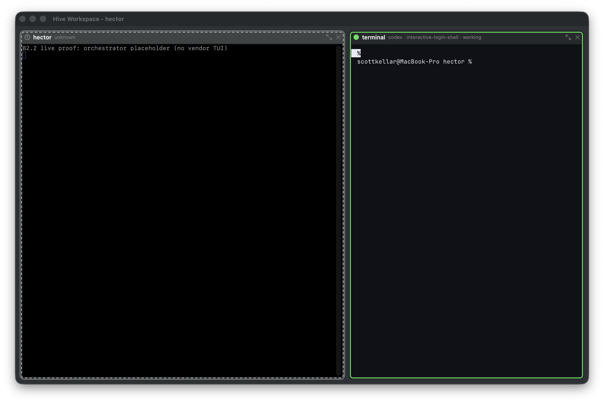

# C1.0 theme transport evidence

Recorded 2026-07-19 EDT on macOS 26.3.1 (25D2128), Apple silicon.

## Runtime and source identity

- Hive implementation pin under test: `d519abfdcf23003c94f95ec8b927ce9876e6ddc3`.
- Ghostty source pin: `73534c4680a809398b396c94ac7f12fcccb7963d`.
- Ghostty declared version: `1.3.2-dev`.
- Hive patch-series SHA-256: `ddeaf79284f0072f29d69dbf6580fd8f58eba98ceff11525f83f91f03f6e09e0`.
- The execution rechecked the current official Ghostty [configuration](https://ghostty.org/docs/config), [configuration reference](https://ghostty.org/docs/config/reference), and [theme loading](https://ghostty.org/docs/features/theme) documentation on 2026-07-19. The pinned source remains authoritative for shipped behavior.

The pinned source exposes explicit-file and default-location loaders as separate calls. Hive calls the explicit-file loader for both construction and live updates and never calls the default-location loader. The generated file contains inline colors and absolute policy values; it contains neither a named `theme` nor a default `font-family`.

## RED then GREEN

Before the transport existed, `swift test --filter C10ThemeTransportTests` exited 1 at compile time: `HiveTerminalTheme` was absent and `applyHiveConfiguration` accepted no theme and returned no result.

At the implementation pin, the focused run exited 0:

```text
Test Suite 'C10ThemeTransportTests' passed
Executed 3 tests, with 0 failures (0 unexpected)
Test Suite 'HiveTerminalConfigurationTests' passed
Executed 7 tests, with 0 failures (0 unexpected)
Test Suite 'Selected tests' passed
Executed 10 tests, with 0 failures (0 unexpected)
```

The proofs exercise the real Ghostty C boundary:

1. A full second theme is pushed to the existing surface. The surface handle and owning app object remain identical, while two distinct `surfaceUpdateConfig` begin/end pairs are observed. This is lifecycle evidence, not by itself evidence that Ghostty consumed the update.
2. On one instrumented real surface, the presented IOSurface background changes from `0f1117` to `182030` after the push. The proof theme deliberately requests `copy-on-select = true`, but Hive emits that base before its overrides, so selecting rendered text still produces no engine clipboard write. An otherwise identical live push without the product override is the negative control and does produce an engine clipboard write.
3. A hostile user-default file sets `background = 010203` and `font-family = Menlo`. The default loader reads it as the positive control, while the Hive-created surface still reads back background `0f1117` from its explicit generated file.

The consumption proof was also run with the production `ghostty_surface_update_config` call deleted. The focused suite exited 1: the IOSurface remained at the original `[15, 17, 22]` pixel instead of the requested `[24, 32, 48]`, producing three channel failures. Restoring the call returned the suite to 3 tests, 0 failures. This mutation demonstrates that the test cannot pass from call-boundary observers alone.

## Real app-window proof

`make terminal`'s production-style B2 harness was run with the real app enabled and port 43130. The actual Workspace process logged:

```text
ghostty_surface_update_config live C1 background=0f1117 font-size=13 padding=10x8 theme=hive-dark
hive-terminal RESIZE 61x39 result: applied 61x39
```

The run rendered the sessiond-backed interactive zsh pane in the real key window. Teardown reported `daemon stopped; session torn down`, and a post-run listener check found port 43130 free.



The window-only PNG has SHA-256 `5b59d528cffdfe3112d217ec78b2512185320703408525217e1100cb9d573629`.

The real-window run proves the production construction and first live push. The distinct-theme/no-recreation and hostile-default claims are separately measured at the real engine boundary above; this evidence does not pretend a proof-only palette was a user-visible setting. The reviewed increment places the real paired-theme selector in C1.2.
